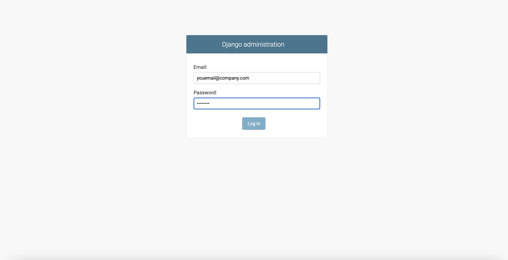
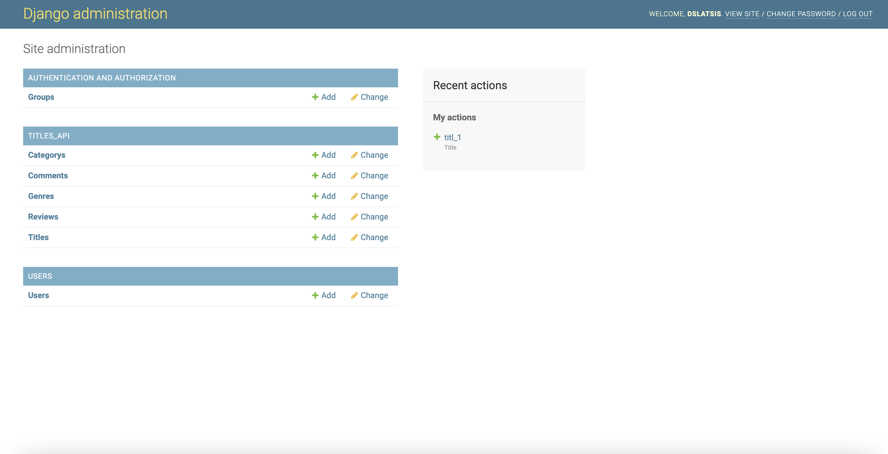
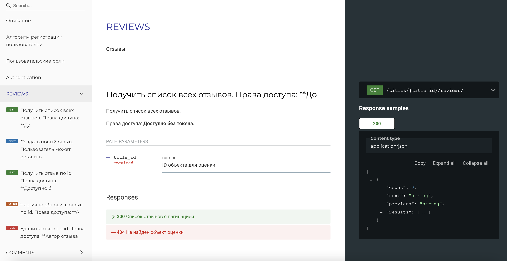

### YaMDB app 
### Описание
Учебный проект для Я.Практикума
### Технологии
Python 3.7 , Django 2.2.6
- Docker 3.8
- Nginx
- Gunicorn
- Pytest
### Подготовка к запуску
- Установите виртуальное окружение:
```
pip install virtualenv
```
- Создайте виртуальное окружение:
```
python -m venv venv
```

- Запустите виртуальное окружение:

```
source venv/bin/activate
```
- Установите зависимости из файла requirements.txt:
```
pip install -r requirements.txt
``` 
- В папке с файлом manage.py выполните команду:
```
python3 manage.py makemigrations
```

### Запуск проекта

- Запускаем сборку контейнеров командой:
```
docker-compose up --build 
```
с флагом ```-d``` запуск произойдет в фоновом режиме.

Спустя некотрое время контейнер запустится и появится сообщение о запуске контейнеров:
```
Starting yamdb_db_1 ... done
Starting yamdb_web_1 ... done
Starting yamdb_nginx_1 ... done
```

### Проверка работоспобности
- Создаем суперпользователя для работы с админкой. Указываем емейл, логин и пароль
``` 
docker-compose exec web python manage.py createsuperuser

Email: practikum@yandex.ru
Username: practikum
Password: 
Password (again): 

Superuser created successfully.


```

- Заходим в браузер по адресу указанному в nginx.conf:
```
server_name 84.201.180.142;
```

# Админка
- Открываем админку <https://84.201.180.142/admin>:


- Вводим данные суперпользователя и авторизуемся:

  
# Redoc
- Открываем конфигурацию API сервера <https://84.201.180.142/redoc>




```Done!```

### Автор
Лацис Дмитрий
